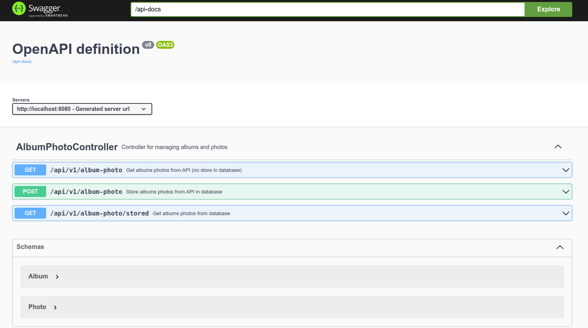
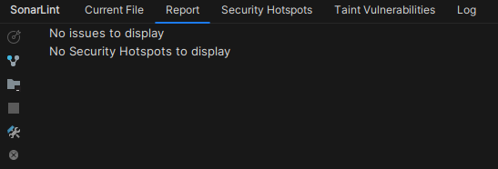
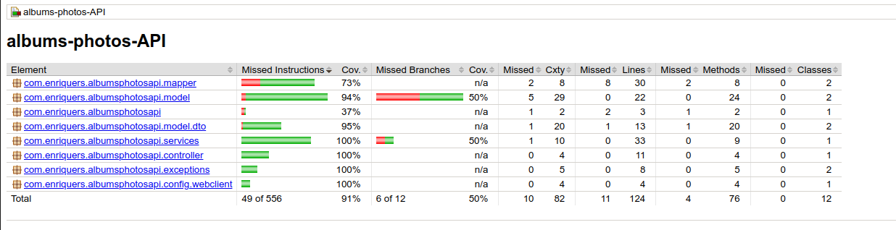

# Planteamiento Inicial
Dado a la naturaleza de los requisitos, se ha decidido usar la programación reactiva para llamar a los eendpoints de forma asíncrona. Así, se puede escalar el sistema de forma más sencilla y se puede gestionar mejor el tiempo de respuesta.

La Arquitectura elegida es una arquitectura de 3 capas, con una capa de presentación, que es el controller donde es la puerta de entrada a la aplicación mediante un API Rest, una capa de negocio y una capa de acceso a datos. 

La capa de presentación es la encargada de recibir las peticiones y enviar las respuestas. La capa de negocio es la encargada de gestionar la lógica de negocio y la capa de acceso a datos es la encargada de gestionar el acceso a los datos.

## Descarga y ejecución
Para descargar el proyecto, se debe ejecutar el siguiente comando:
```bash
git clone git@github.com:EnriqueRS/albums-photos-api.git
```
Para ejecutar el proyecto, se debe ejecutar el siguiente comando:
```bash
mvn spring-boot:run
```


## Patrones usados
- Singleton: para la creación del webclient
- Repository: para la capa de acceso a datos, agnosticismo de la fuente de datos
- Factory: para la creación del webclient, así se puede escalar si se cambia de API

## Tecnologías usadas
- Java 17
- Spring Boot 3
- Maven
- Lombok (para reducir el código mediante anotaciones)
- Sonar (para el análisis estático del código)
- Docker (para la creación de la imagen)
- Swagger (para la documentación de la API con OpenAPI)
- Junit Jupiter (JUnit 5) y Mockito para los tests


## Docker
Para ejecutar la aplicación en un contenedor de docker, se debe ejecutar el siguiente comando:
```bash
 docker build -t albums-photos-api .
```
```bash
docker run -p 8080:8080 albums-photos-api
```

## Variables de entorno
Se han usado las variables de entorno para parametrizar la configuracion. Aunque se ponen como valores por defecto para que funcione sin ellas.

## Logs
Se ha usado slf4j para los logs.

## Tests
Se han creado tests unitarios para los servicios y los controladores. Se ha usado Junit Jupiter (JUnit 5) y Mockito para los tests.

## Swagger
Se ha añadido la documentación de la API con OpenAPI. Para acceder a ella, se debe ir a la siguiente URL:
```bash
http://localhost:8080/swagger-ui.html
```


## SonarLint
Se ha usado SonarLint para el análisis estático del código. Se adjunta el análisis:


## Cobertura de tests
Se adjunta la cobertura de tests, generado mediante Jacoco.:

